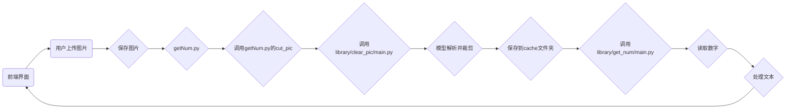

# 铸造字识别系统源码说明
## 文件目录

```file_tree
./
├── cache/
│   └── crop.jpg
├── flask/
├── library/
│   ├── clear_pic
│   ├── get_num
│   ├── yolo
│   └── __init__.py
├── flask-dist/
│   ├── assets
│   ├── UPLOAD
│   ├── vite.svg
│   └── index.html
├── requirements.txt
├── getNum.py
└── main.py
```

| 目录         | 说明        |
|------------|-----------|
| cache      | 剪裁后数字区域图片 |
| flask      | 可删除，不影响使用 |
| library    | 前置运行库     |
| flask-dist | 前端界面      |

## 模型介绍
该程序采用双模型辅助识别，模型数据如下:

| 模型名          | 路径                  |
|--------------|---------------------|
| NumVision.pt | /library/clear_pic/ |
| best.pt      | /library/get_num/   |

## 运行结构
### 大致过程
> 图片 > 剪裁数字区域 > 识别文字 > 输出结果
### 全部过程



