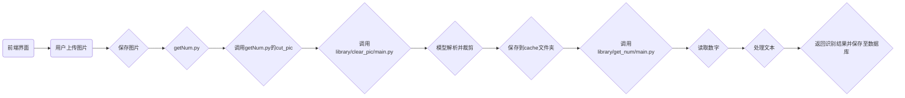

# 铸造字识别系统源码说明
## 文件目录

```file_tree
./
├── cache/
│   └── crop.jpg
├── flask/
├── flask-dist/
│   ├── assets
│   ├── UPLOAD
│   ├── vite.svg
│   └── index.html
├── requirements.txt
├── CCRS_Library-*.whl (打包完毕的依赖库)
├── getNum.py
└── main.py
```

| 目录         | 说明        |
|------------|-----------|
| cache      | 剪裁后数字区域图片 |
| flask      | 可删除，不影响使用 |
| flask-dist | 前端界面      |


## 运行结构
### 大致过程
> 图片 > 剪裁数字区域 > 识别文字 > 输出结果
### 全部过程


## 注意
自2.0.0开始，我们将模型及依赖库整合为[CCRS_Library](https://github.com/xin1201946/CRS_Library)包


